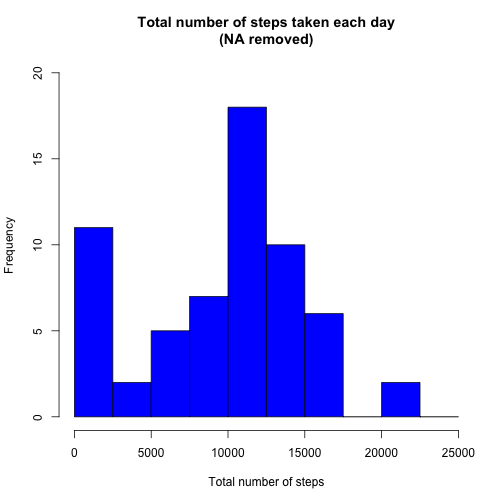
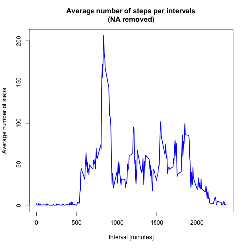
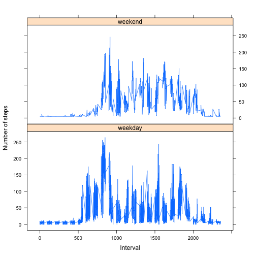

Peer Assessment 1 : Personal Activity Tracking
==============================================
Created by Bert CARLIER - Jan 10th 2016

Let's make sure that other's can read our file

```r
echo=TRUE
```

## Part I: Loading and Preprocessing data

Objectives:
* a: Convert the data in column "data" into POSIXct class data, so they are readable as a date
* b: Calculate the number of weekdays
* c: Identify whether a day is a weekday or day in the weekend
* d: Create a final dataframe holding the date, the weekday number, the weekday type, the interval and the number of steps


```r
# Clear the workspace
rm(list=ls())

# Load the raw activity data
activity_raw <- read.csv("activity.csv", stringsAsFactors=FALSE)

# Converting the dates into POSIXct class data, so they are readable as dates
activity_raw$date <- as.POSIXct(activity_raw$date, format="%Y-%m-%d")

# Calculating the weekday number
activity_raw <- data.frame(date=activity_raw$date, 
                           weekday=tolower(weekdays(activity_raw$date)), 
                           steps=activity_raw$steps, 
                           interval=activity_raw$interval)

# Compute the day type (weekend or weekday)
activity_raw <- cbind(activity_raw, 
                      daytype=ifelse(activity_raw$weekday == "saturday" | 
                                       activity_raw$weekday == "sunday", "weekend", 
                                     "weekday"))

# Creating a new data frame with all the attributes
activity <- data.frame(date=activity_raw$date, 
                       weekday=activity_raw$weekday, 
                       daytype=activity_raw$daytype, 
                       interval=activity_raw$interval,
                       steps=activity_raw$steps)

# Clear the workspace
rm(activity_raw)
```

##      PART II: Mean total number of steps per day

For this part of the assignment, you can ignore the missing values in the dataset.

* Calculate the total number of steps taken per day
* If you do not understand the difference between a histogram and a barplot, research the difference between them. Make a histogram of the total number of steps taken each day
* Calculate and report the mean and median of the total number of steps taken per day


```r
# Summing up the total number of steps per day (NA value removed)
sum_activity <- aggregate(activity$steps, by=list(activity$date), FUN=sum, na.rm=TRUE)

# Giving new header names
names(sum_activity) <- c("date", "total steps")

# Construcuting a histogram
hist(sum_activity$total, 
     breaks=seq(from=0, to=25000, by=2500),
     col="blue", 
     xlab="Total number of steps", 
     ylim=c(0, 20), 
     main="Total number of steps taken each day\n(NA removed)")
```



Calculating mean and median:

```r
mean(sum_activity$total)
```

```
## [1] 9354.23
```

```r
median(sum_activity$total)
```

```
## [1] 10395
```

**The mean and median are respecively 9354 and 10395 The difference between both is large. It can be ascribed that the data set contains many outliers, or is at least biased in its extremes. We can make mean calculations more prone to outliers by assigning a number to the missing values in the "steps" columns.**


##      PART III: Differences weekdays vs weekends

* Make a time series plot (i.e. 𝚝𝚢𝚙𝚎 = "𝚕") of the 5-minute interval (x-axis) and the average number of steps taken, averaged across all days (y-axis)


```r
# Clear the workspace
rm(sum_activity)

# Calculating the means of steps accross all days for each interval
mean_activity <- aggregate(activity$steps, 
                       by=list(activity$interval), 
                       FUN=mean, 
                       na.rm=TRUE)

# Giving new header names
names(mean_activity) <- c("interval", "mean")
```

Now we can create a new time series plot:

```r
# Creating a time series plot
plot(mean_activity$interval, 
     mean_activity$mean, 
     type="l", 
     col="blue", 
     lwd=2, 
     xlab="Interval [minutes]", 
     ylab="Average number of steps", 
     main="Average number of steps per intervals\n(NA removed)")
```



* Which 5-minute interval, on average across all the days in the dataset, contains the maximum number of steps?


```r
# Find the position holding the maximum number of steps
max_pos <- which(mean_activity$mean == max(mean_activity$mean))

# Looking up the value of the interval for this workspace
max_interval <- mean_activity[max_pos, 1]

# Clear the workspace
rm(max_pos, mean_activity)
```

**The 5-minute interval that contains the maximum of steps, on average across all days, is 835.**

##      PART IV: Inputing the missing values

Note that there are a number of days/intervals where there are missing values (coded as NA). The presence of missing days may introduce bias into some calculations or summaries of the data.

* Calculate and report the total number of missing values in the dataset (i.e. the total number of rows with NA’s)


```r
# Clear the workspace
rm(max_interval)

# Counting the number of NAs using a boolean function is.na().
NA_count <- sum(is.na(activity$steps))
```
**The number of NA’s is 2304.**

* Devise a strategy for filling in all of the missing values in the dataset. The strategy does not need to be sophisticated. For example, you could use the mean/median for that day, or the mean for that 5-minute interval, etc.

**We will mitigate the bias caused by the missing values by replacing the NA values by the mean steps of the non-NA-data.We will do this by creating a vector meanNonNA_vec holding the n times the mean of the non-NA values, with n the number of NA values.**


```r
# Clear the workspace
rm(NA_count)

# Find the NA positions
na_pos <- which(is.na(activity$steps))

# We will mitigate the bias caused by the missing values by 
# replacing the NA values by the mean steps of the non-NA-data
# We will do this by creating a vector meanNonNA_vec holding the n times
# the mean of the non-NA values, with n the number of NA values 
meanNonNA_vector <- rep(mean(activity$steps, na.rm=TRUE), times=length(na_pos))
```

* Create a new dataset that is equal to the original dataset but with the missing data filled in.


```r
# Replace the NAs by the means
activity[na_pos, "steps"] <- meanNonNA_vector 

# Clear the workspace
rm(meanNonNA_vector, na_pos)
```

* Make a histogram of the total number of steps taken each day and Calculate and report the mean and median total number of steps taken per day. Do these values differ from the estimates from the first part of the assignment? What is the impact of imputing missing data on the estimates of the total daily number of steps?


```r
# Compute the total number of steps each day (NA values removed)
sum_activity <- aggregate(activity$steps, by=list(activity$date), FUN=sum)

# Giving new header names
names(sum_activity) <- c("date", "total")

# Creating the histogram of the total number of steps each day
hist(sum_activity$total, 
     breaks=seq(from=0, to=25000, by=2500),
     col="blue", 
     xlab="Total number of steps", 
     ylim=c(0, 30), 
     main="Total number of steps taken each day\n(NA replaced by mean value)")
```


Computing mean and median now

```r
mean(sum_activity$total)
```

```
## [1] 10766.19
```

```r
median(sum_activity$total)
```

```
## [1] 10766.19
```

**The mean and median are respecively 10766 and 10766. Mean and median are much closer together now. Replacing NA values by the means of non-NA steps values weakened the relative contribution of outliers. Our data are now more continuous**. 

##      PART V: DIFFERENCES WEEKDAYS AND WEEKEND DAYS

* Create a new factor variable in the dataset with two levels – “weekday” and “weekend” indicating whether a given date is a weekday or weekend day.

**Note: We already included an attribute "day type" in PART I of the exercise**

* Make a panel plot containing a time series plot (i.e. 𝚝𝚢𝚙𝚎 = "𝚕") of the 5-minute interval (x-axis) and the average number of steps taken, averaged across all weekday days or weekend days (y-axis). See the README file in the GitHub repository to see an example of what this plot should look like using simulated data.


```r
# Clear the workspace
rm(sum_activity)

# Loading the lattice graphical library
library(lattice)

# Calculate the average number of steps taken, averaged across all daytype variable
mean_activity <- aggregate(activity$steps, 
                       by=list(activity$daytype, 
                               activity$weekday, activity$interval), mean)

# Giving new header neames
names(mean_activity) <- c("daytype", "weekday", "interval", "mean")

# Creating a time series plot for each day tpe
xyplot(mean ~ interval | daytype, mean_activity, 
       type="l", 
       lwd=1, 
       xlab="Interval", 
       ylab="Number of steps", 
       layout=c(1,2))
```



```r
# Clear the workspace
rm(mean_activity)
```
